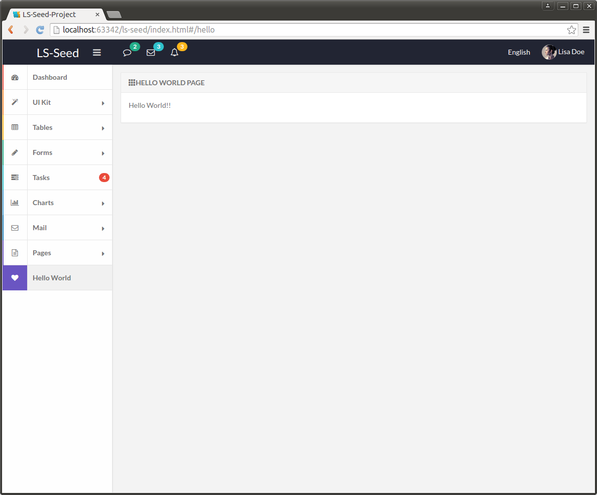

# HACKING

###Adding a new view/controller that is reached through navigation menu

#####Create view helloworld.html in directory ui/views/helloworld using flatify blank template at ui/views/pages/blank.html

```html
<div class="page" data-ng-controller="helloCtrl">
    <section class="panel panel-default">
        <div class="panel-heading"><strong><span class="glyphicon glyphicon-th"></span>Hello World Page</strong></div>
        <div class="panel-body">
            <p>{{hello}}</p>
        </div>
    </section>
</div>
```

#####Create module HelloWorldCtrl.js in directory ui/js/HelloWorld

```javascript
define(['angular'], function (angular) {
    'use strict';
    return angular.module('app.helloworld.ctrls', []).controller('helloCtrl', [
        '$scope', function($scope) {
            $scope.hello = 'Hello World!!';
        }
    ]);
});
```

#####Inject the module into the application by adding to app.js

```javascript
define([
    //third party libraries
    //other angular modules
    './HelloWorld/HelloWorldCtrl'
    ], function(ng) {
        'use strict'
        return ng.module('lsseedApp', [
            //other angular modules
            'app.helloworld.ctrls'
        ]);
});
```

#####Update ui/views/nav.html to include menu option for new view by adding new li

```html
<div id="nav-wrapper">
    <ul id="nav"
        data-ng-controller="NavCtrl"
        data-collapse-nav
        data-slim-scroll
        data-highlight-active>
        ...
        <li><a href="#/hello"> <i class="fa fa-heart"><span class="icon-bg bg-violet"></span></i>Hello World</span> </a></li>
        ...
    </ul>
</div>
```
+ **fa fa-heart** refers to a set of FontAwesome icons of which currently 500+ available. More info at: (https://fortawesome.github.io/Font-Awesome/icons/)
+ **icon-bg bg-violet** Other background color definitions can be found at ui/stylesheets/ui/components/_scaffolding.scss

#####Update ui/js/routes.js to include router for our new view

```javascript
define(['./app'], function (app) {
    'use strict';
    app.config([
        '$routeProvider', function($routeProvider) {
            return $routeProvider.when('/', {
                redirectTo: '/dashboard'
            }).when('/dashboard', {
                templateUrl: 'ui/views/dashboard.html'
            ...
            }).when('/hello', {
                templateUrl: 'ui/views/helloworld/helloworld.html'
            }).otherwise({
                redirectTo: '/404'
            });
        }
    ]);
});
```
#####End result

